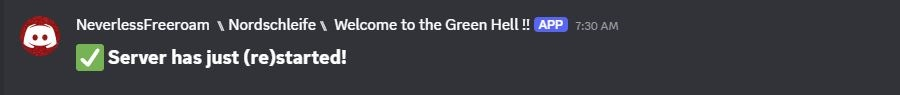
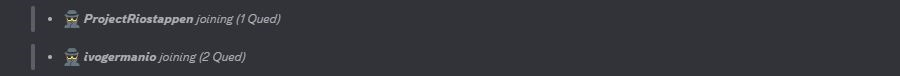
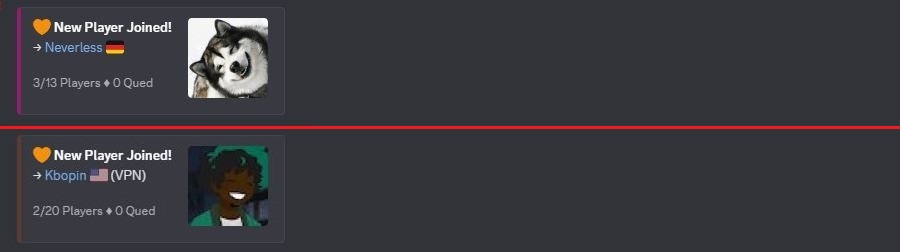
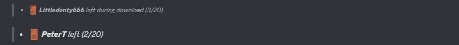
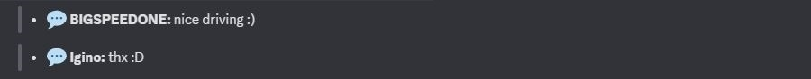
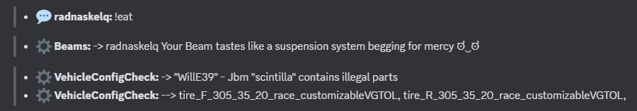
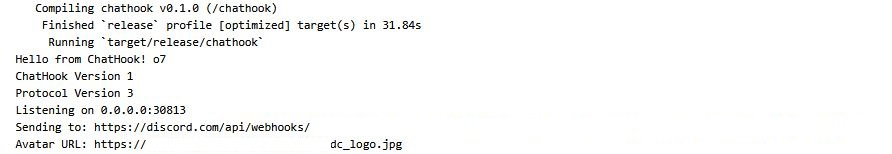
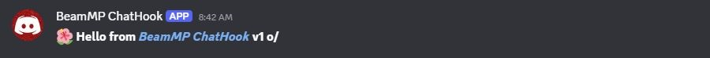
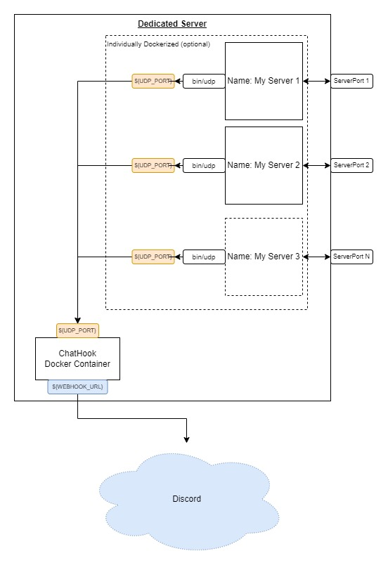
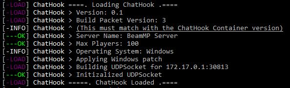

# BeamMP-ChatHook
## A discord tool that posts your Server *happenings* to a discord Webhook!


# Featuring
### - Server (re)starts!


### - Players in the joining process!


### - When the player has fully joined!
- With BeamMP Profile picture, Country flag and VPN Check



### - When a player has left!


### - Chat Messages!


### - Script messages!


## Its half Smart
- The ChatHook Seperates Fully joined players from still joining players (qued players) when it shows the Player count in any given message.
- The ChatHook automatically pulls and caches player profile pictures for player join messages from the BeamMP forum api.
- The ChatHook uses [ip-api.com](https://ip-api.com/) to get a result for each players country and if they are using a vpn or proxy
- Chat Commands starting with a `/` are automatically ignored!

## For modders
You can send Script messages to the webhook by simply doing this (Full discord formatting support including links!).
```lua
MP.TriggerGlobalEvent("onScriptMessage", "__**My Fancy Script message**__", "Script Name")
```

# How to install
### ChatHook
ChatHook is a tool that runs independent from a BeamMP Server. All your BeamMP Servers can send it data with the Server side script (Instructions below).

**To Install it you have 2 options**

In any case, clone this repository to your harddrive first!

#### [Docker Compose](https://docs.docker.com/compose/)
<details>
<summary>Click to Open</summary>

1. Go into the `ChatHook Container` folder
2. Rename `.env.example` to `.env`
3. Open `.env` in the text editor of your choice. You will see
```
WEBHOOK_URL=https://discord.com/api/webhooks/*
UDP_PORT=30813
EXPOSE_TO_NETWORK=172.17.0.1
AVATAR_URL=https://my-website.com/myImage.jpg
```
- `WEBHOOK_URL` defines the webhook url you got from discord.
- `UDP_PORT` defines the port it will listen to for messages from your BeamMP Servers
- `EXPOSE_TO_NETWORK` defines the network to expose the port to. Note: If not changed, the container is bound to the `bridge` network, which by default has the gateway of `172.17.0.1`. You generally __never__ want to expose to `0.0.0.0`
- `AVATAR_URL` defines the image used in the messages displayed in your discord channel!

Edit these variables to your liking, save and then exit.

4. Next open a Terminal in this directory.
5. And simply install the container with `sudo docker compose up -d`



Note: The Container is build in a self compiling way. Which means that updating any of the source files and then restarting the container will automatically trigger a recompile!

</details>


#### Manual
<details>
<summary>Click to Open</summary>

1. Install the [Rust Toolchain](https://www.rust-lang.org/)
2. Go into `ChatHook Container/chathook`
3. Open a Terminal/Cmd in this directory
4. run `cargo build --release`. This will compile the tool!
5. Within the `target/release` folder is the `chathook.exe`

To run it you can setup an autostart in your Operating System.
It will read the necessary information such as the webhook url from the environment or the given arguments.

**Arguments**

`chathook.exe webhook_url udp_port avatar_url`

eg. `chathook.exe https://discord.com/api/webhooks/* 30814 https://my-website.com/myImage.jpg`


**Environment Variables**

Setting environment variables is different per Distribution (You will have to look this up).
```
WEBHOOK_URL="https://discord.com/api/webhooks/*"
UDP_PORT=30813
AVATAR_URL=https://my-website.com/myImage.jpg
```
- `WEBHOOK_URL` defines the webhook url you got from discord.
- `UDP_PORT` defines the port it will listen to for messages from your BeamMP Servers
- `AVATAR_URL` defines the image used in the messages displayed in your discord channel!

Then simply start the ChatHook binary!
</details>

---



#### Network Infographic
<details>
<summary>Click to Open</summary>



</details>


### BeamMP Server
1. Copy the `Server/ChatHook` folder to your Servers `Resources/Server` directory
2. Open the `Resources/Server/ChatHook/main.lua` file in a text editor of your choice. You will see
```lua
local CHATHOOK_IP = "172.17.0.1"
local UDP_PORT = 30813
```
- `CHATHOOK_IP` set this to eg `127.0.0.1` or the IP of the ChatHook container that you defined earlier with `EXPOSE_TO_NETWORK`
- `UDP_PORT` set this to the port of the ChatHook that you defined earlier with the `UDP_PORT`

Then save and exit.

3. Now simply start the BeamMP Server!



**If everything is setup right then you can now see the Server started message in your discord (:**

Note: The Serverside script is Hotreload safe.